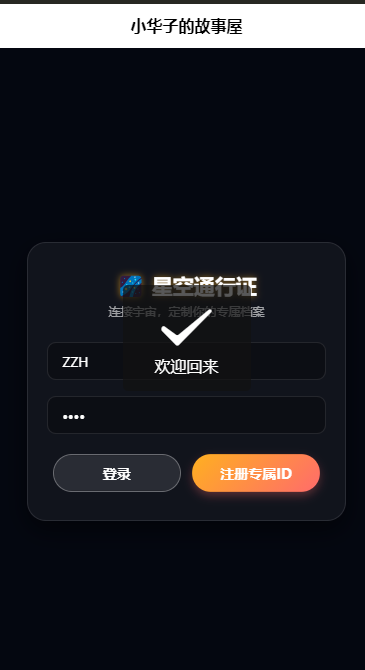
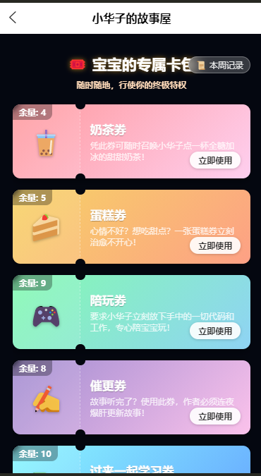
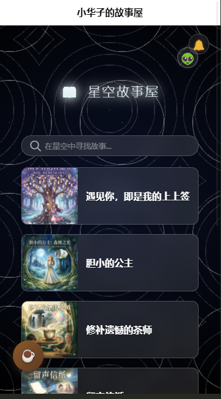

# 🌌 Starry-Interactive (星空互动系统)


> 基于 Serverless 架构与 uni-app 开发的跨平台多端实时互动与数字资产管理系统。

## 📖 项目简介

本项目是一个完整的全栈移动端应用，旨在提供低延迟、高可靠的跨设备互动体验。项目抛弃了传统的后端服务器运维，全面采用 **uniCloud (Serverless)** 架构，实现了从用户鉴权、数据持久化到云函数分发的全链路闭环。

在前端 UI 层面，抛弃了臃肿的第三方组件库，采用纯 CSS3 硬件加速实现了极具沉浸感的“动态星空”视觉与 Glassmorphism（毛玻璃）交互界面。

## ✨ 核心技术成果 (Core Achievements)

### 1. 🚀 高可用跨端消息触达机制（双保险保活方案）
针对各大安卓定制系统（如 MIUI、ColorOS）严苛的后台进程查杀与横幅通知拦截机制，设计并落地了**“长连接监听 + 异步轮询查岗”**的双保险兜底方案：
* **链路 A (在线强提醒)**：集成 `uniPush 2.0` 扩展库，通过设备 CID 精准下发云端指令。在 App 生命周期内注册全局监听器 (`uni.onPushMessage`)，半路拦截底层系统信号，实现 100% 触发应用内自定义全局模态框与震动反馈。
* **链路 B (离线状态同步)**：构建基于 NoSQL 的云端信箱 (`star_notifications`)。利用前端 `onShow` 生命周期进行异步轮询，确保应用在被系统强杀重启后，依然能无损拉取并重放离线期间的关键业务指令。

### 2. ⚡️ Serverless 全栈架构闭环
* 独立完成云端 NoSQL 数据库的设计（包含 `star_users`, `ticket_wallet`, `ticket_history` 等集合），实现多表联动。
* 编写基于 Node.js 的云函数 (`send-ticket-push`)，处理高并发下的库存扣减、历史账单生成与推送指令下发，确保业务闭环的原子性与数据一致性。
* 彻底免除传统后端的服务器部署与接口跨域烦恼，接口响应时间大幅缩短。

### 3. 🎨 零依赖的高性能渲染 UI
* 纯手写前端交互逻辑，利用 CSS3 `@keyframes` 与 `repeating-radial-gradient` 构建了低 GPU 消耗的无限循环星空背景。
* 大面积应用 `backdrop-filter: blur()` 实现多层级的毛玻璃视觉，在保证跨平台（Android/iOS）兼容性的同时，将核心安装包体积压缩至极致。

## 🛠 技术栈 (Tech Stack)

* **前端框架**：Vue.js, uni-app
* **后端架构**：uniCloud (阿里云 Serverless), Node.js 云函数
* **数据库**：uniCloud DB (NoSQL / MongoDB 语法)
* **核心模块**：uniPush 2.0 (实时消息推送 SDK)
* **UI/样式**：纯原生 CSS3, Flexbox 响应式布局

## 📱 核心界面展示 (Screenshots)


| 登录鉴权模块 | 核心资产卡包 | 首页 |
| :---: | :---: | :---: |
|  |  |  |

## 📦 快速开始 (Quick Start)

如果你想在本地运行或二次开发本项目，请按照以下步骤操作：

1. **克隆项目到本地**
   ```bash
   git clone
   导入开发工具

2. 下载并安装 HBuilderX。

在 HBuilderX 中点击 文件 -> 导入 -> 从本地目录导入，选择克隆下来的项目文件夹。

3. 配置 Serverless 环境

在 HBuilderX 中右键点击 uniCloud 目录，选择 关联云服务空间。

右键点击 database 目录，选择 初始化云数据库 (上传所有 schema)。

右键点击 cloudfunctions 目录下的云函数，选择 上传部署。

4. 编译运行

点击顶部菜单栏 运行 -> 运行到手机或模拟器 / 运行到内置浏览器。

📝 目录结构简析
Plaintext
├── App.vue                 # 应用配置与全局推送监听器 (第一道保险)
├── pages/
│   ├── login/              # 登录与设备 CID 强绑定逻辑
│   ├── storyList/          # 业务大厅与离线消息轮询 (第二道保险)
│   └── cardWallet/         # 核心交互页：券包渲染、状态结算、发射云函数
├── uniCloud/
│   ├── cloudfunctions/     # 后端 Node.js 业务逻辑代码
│   └── database/           # NoSQL 数据库集合的 Schema 设计图纸
└── manifest.json           # 应用配置 (打包、Push模块声明)
🤝 开发者 (Author)
全栈开发：[张梓铧]

核心定位：深入探索移动端跨设备通信与 Serverless 落地实践。
